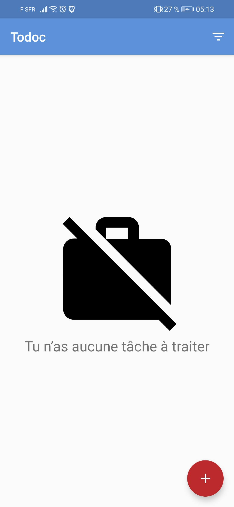
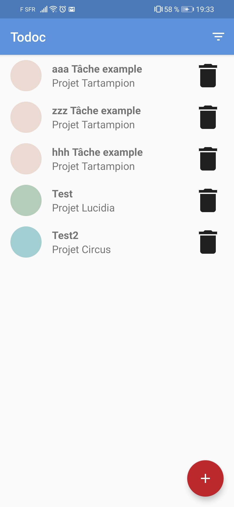
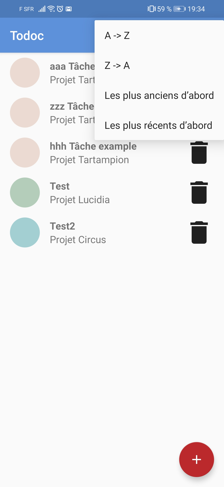
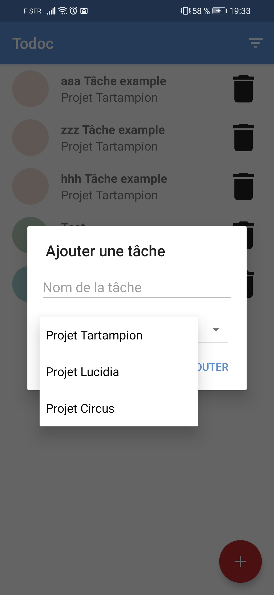

# OpenClassrooms - Todoc

## Développement d'application mobile - Projet 5

> L'application Todoc sert à lister les tâches à accomplir pour les collaborateurs de l'entreprise CleanUp.

## Objectifs

> L'application est existante, les fonctionnalités sont déjà développées.

Gérer la persistance des données.

- Implémentation d'une base de données SQLite. 
- Réalisation du Modèle Physique des Données.
- Réalisation du diagramme de classes.
- Réalisation du diagramme d'utilisation.
- Déploiements de l'app sur le Play Store en mode Bêta.
- Mises à jour des tests afin d'intégrer SQLite à l'application.

---

## Contenus

- [Objectifs](#objectifs)
- [Installation](#installation)
- [Fonctionnalités](#fonctionnalités)

---

## Installation

### Télécharger l'application
- Le lien du projet est le suivant : git@github.com:Elyt622/Todoc.git
- Cliquez sur le bouton "Clone or Download"
- Téléchargez le projet en cliquant sur "Download ZIP"

### Cloner l'application
- Cloner le projet à partir d'un terminal avec la commande: "git clone git@github.com:Elyt622/Todoc.git"

### Installation
- Importer le projet dans Android Studio
- Lancer le projet

---

## Fonctionnalités

- Mise en place de l'architecture MVVM
- Utilisation du type LiveData
- Utilisation de Room & DAO

## Images de l'application

  

  
